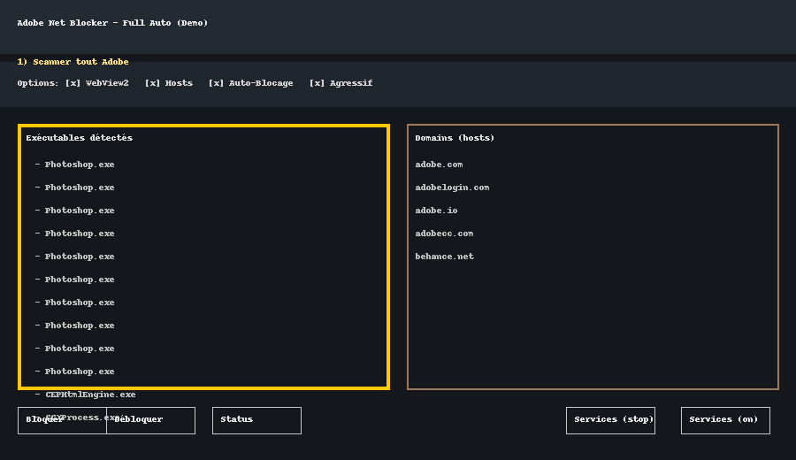

# Adobe Net Blocker - Full Auto


**Auteur : Zakaria Yacine Boucetta**

**Adobe Net Blocker** est un outil Windows qui bloque totalement l’accès à Internet de toutes les applications et services Adobe, ainsi que des composants liés, tout en laissant votre navigateur et vos autres logiciels fonctionner normalement.

## Fonctionnalités principales

- **Scan complet** : détecte automatiquement **tous** les `.exe` dans les dossiers Adobe (`Program Files`, `Program Files (x86)`, `Common Files`, `AppData\Local`, `AppData\Roaming`, etc.).
- **Blocage pare-feu** : ajoute des règles Windows Firewall (in/out, tous protocoles) pour chaque exécutable trouvé.
- **Blocage par hosts** : ajoute dans le fichier `hosts` les domaines connus d’Adobe (modifiable depuis l’interface).
- **Mode agressif** *(activé par défaut)* :
  - Arrête et désactive les services Adobe (`AdobeUpdateService`, `AGSService`, `AdobeARMservice`...).
  - Désactive toutes les tâches planifiées contenant “Adobe”.
- **Option WebView2** : bloque aussi le moteur WebView2 utilisé par Photoshop/UXP (peut impacter d’autres applications qui l’utilisent).
- **Auto-blocage au démarrage** : bloque tout dès que l’outil est lancé (désactivable).
- **Interface graphique** simple et complète avec édition des domaines, ajout/suppression d’exécutables, boutons de blocage/déblocage.

## Prérequis

- **Windows** (testé sur 10 et 11).
- **Droits administrateur** (indispensable pour modifier le pare-feu et le fichier `hosts`).
- Python **3.9+** si utilisation du script `.py`.
- [PyInstaller](https://pyinstaller.org/) uniquement si vous souhaitez compiler en `.exe`.

## Démonstration



## Téléchargement et exécution

### 1. Exécutable prêt à l’emploi
Si vous avez la version `.exe` :
- Clic droit → **Exécuter en tant qu’administrateur**.
- Configurez vos options et cliquez sur **Bloquer**.

⚠️ **Note sur les antivirus** :  
L’exécutable est compilé avec **PyInstaller**. Ce type de binaire peut générer un **faux positif** sur certains antivirus (notamment Windows Defender) car il contient l’environnement Python embarqué.  
Ce projet est **open source** : vous pouvez **vérifier le code**, puis **compiler vous-même** pour garantir l’intégrité.

### 2. Lancer depuis le code source
1. Téléchargez/cloner le repo :
   ```powershell
   git clone https://github.com/<votre-repo>/adobe-net-blocker.git
   cd adobe-net-blocker
   ```
2. Installez les dépendances (optionnel, script utilise seulement la lib standard Python).
3. Exécutez :
   ```powershell
   python adobe_net_blocker_gui.py
   ```

## Compilation en `.exe` (optionnel)
Vous pouvez compiler l’outil en exécutable autonome avec PyInstaller :

```powershell
pip install pyinstaller
pyinstaller --noconsole --onefile --uac-admin --add-data "domains.txt;." adobe_net_blocker_gui.py
```

L’exécutable sera disponible dans le dossier `dist/`.

## But du projet
Ce projet est **à but non lucratif** et purement **éducatif**.  
Il est destiné à montrer comment utiliser le pare-feu Windows et les fichiers `hosts` pour bloquer des connexions réseau spécifiques.  
L’auteur ne saurait être tenu responsable de toute utilisation contraire aux lois en vigueur.

## Licence
Ce projet est distribué sous licence **MIT**. Vous êtes libre de l’utiliser, le modifier et le redistribuer.

## Avertissement
Cet outil bloque **tous les services et communications Adobe**. Certaines fonctionnalités (mises à jour, synchronisation Creative Cloud, bibliothèques en ligne, etc.) ne fonctionneront plus tant que le blocage est actif.

---
